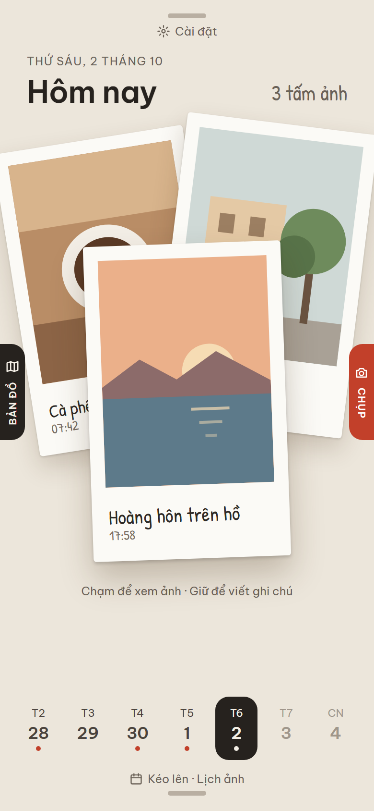
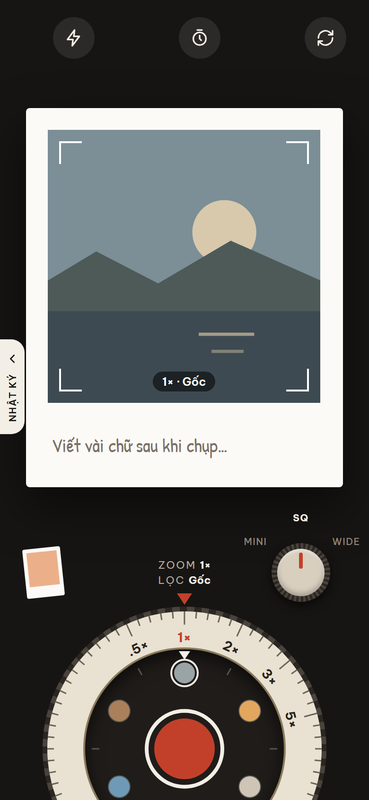
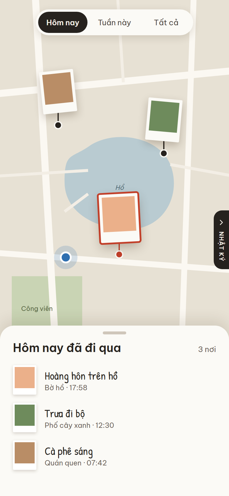
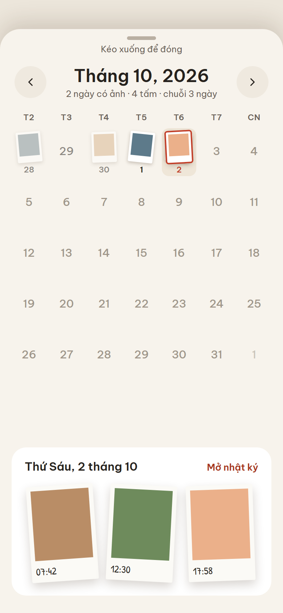
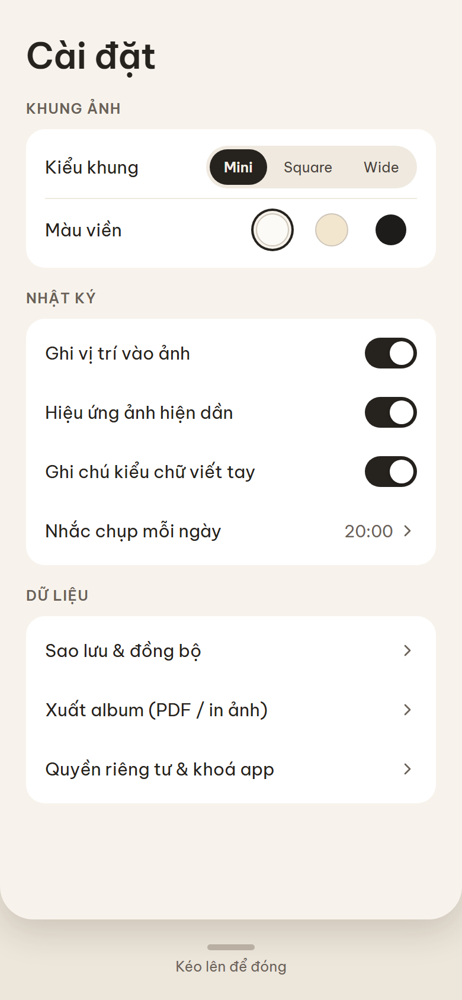

# Photo Diary

A tiny, private photo diary that feels like carrying a cute early-2000s digital camera.
Camera → memory → Polaroid → timeline → map. Local-first: no account, no server, no uploads.

Runs on **iPhone, Android and Web** from one Expo (SDK 57) + TypeScript codebase, structured as MVVM.
See [docs/ARCHITECTURE.md](docs/ARCHITECTURE.md).

## Screenshots

<table>
  <tr>
    <td align="center"><br><sub><b>Diary</b> · today's prints</sub></td>
    <td align="center"><br><sub><b>Camera</b> · zoom &amp; film dial</sub></td>
    <td align="center"><br><sub><b>Map</b> · where you've been</sub></td>
  </tr>
  <tr>
    <td align="center"><br><sub><b>Calendar</b> · pull up from the day strip</sub></td>
    <td align="center"><br><sub><b>Settings</b> · pull down from the top</sub></td>
    <td></td>
  </tr>
</table>

Swipe left/right between Map ← Diary → Camera; Calendar and Settings are sheets over the diary.
Images are rendered from the design artboards in [docs/design/](docs/design/).

## Requirements

- Node.js 20+ (LTS)
- Phone: the **Expo Go** app (iOS App Store / Google Play), on the same Wi-Fi as your computer
- Web: any modern browser (camera & location need `localhost` or HTTPS)

## Run

```bash
npm install
npm start            # dev server; scan the QR code with Expo Go (Android) or the Camera app (iOS)
npm run android      # open on a connected Android device/emulator
npm run ios          # open on iOS simulator (macOS only)
npm run web          # open the web version at http://localhost:8081
```

## Checks

```bash
npm run typecheck    # tsc --noEmit
npm run lint         # expo lint
npm test             # jest (repositories, clustering, timeline, utils)
npx expo export --platform android --platform ios --platform web   # production bundles
```

## Builds

- Web: `npx expo export --platform web` → static SPA in `dist/` (serve over HTTPS).
- Native store builds: `npx eas-cli@latest build`. Android standalone builds need a Google Maps API key in
  `app.json` → `android.config.googleMaps.apiKey` (Expo Go works without it).

## Scripts

- `node scripts/generate-icons.js` — regenerates the Polaroid app icon set in `assets/`.
- `node scripts/generate-shutter-sound.js` — regenerates `assets/sounds/shutter.wav`.
